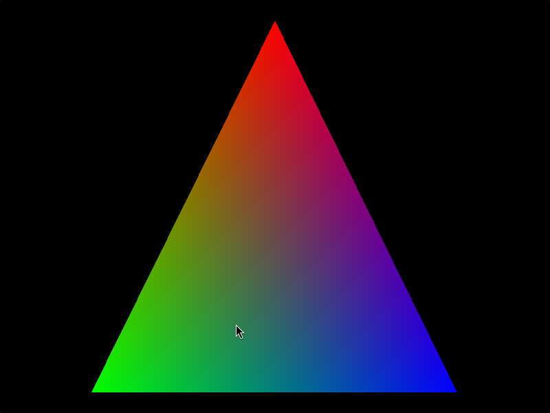

# zig_sdl3_triangle

A simple project demonstrating how to render a colorful triangle using Zig and SDL 3. This example sets up an SDL window, a renderer, defines vertices for a triangle with distinct colors, and renders it to the screen while handling basic window events.



## Features

*   **Colorful Triangle Rendering**: Displays a single triangle with red, green, and blue vertices.
*   **SDL 3 Integration**: Utilizes SDL 3 for window creation, rendering context, and event handling.
*   **Basic Event Loop**: Handles window close events to gracefully exit the application.
*   **Framerate Capping**: Includes a basic framerate capper to limit rendering to 60 FPS.

## Prerequisites

To build and run this project, you will need:

*   **Zig Compiler**: Ensure you have a recent version of the Zig compiler installed. You can download it from [ziglang.org](https://ziglang.org/).
*   **SDL 3 Development Libraries**: You need the SDL 3 development libraries installed on your system.

    *   **On Ubuntu/Debian**:\
        ```bash
        sudo apt-get update
        sudo apt-get install libsdl3-dev
        ```
    *   **On macOS (using Homebrew)**:\
        ```bash
        brew install sdl3
        ```
    *   **On Windows**: Download the development libraries from the [SDL website](https://github.com/libsdl-org/SDL/releases) and configure your build environment.

## Building and Running

Follow these steps to build and run the `zig_sdl3_triangle` project:

1.  **Clone the repository (if you haven't already):**
    ```bash
    git clone https://github.com/your-username/zig_sdl3_triangle.git # Replace with actual repo URL
    cd zig_sdl3_triangle
    ```

2.  **Build the project:**
    ```bash
    zig build
    ```

3.  **Run the executable:**
    ```bash
    zig build run
    ```
    Alternatively, you can manually run the compiled executable:\
    ```bash
    ./zig-out/bin/sdl_triangle # The exact path might vary based on your system
    ```
